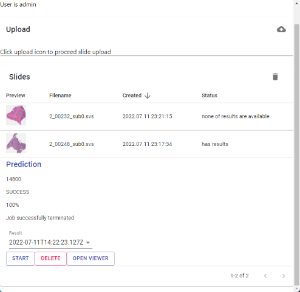
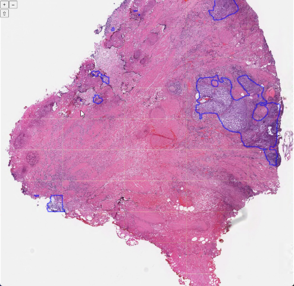
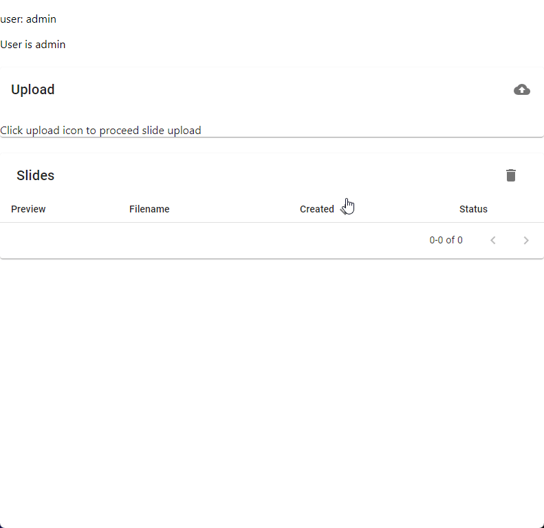
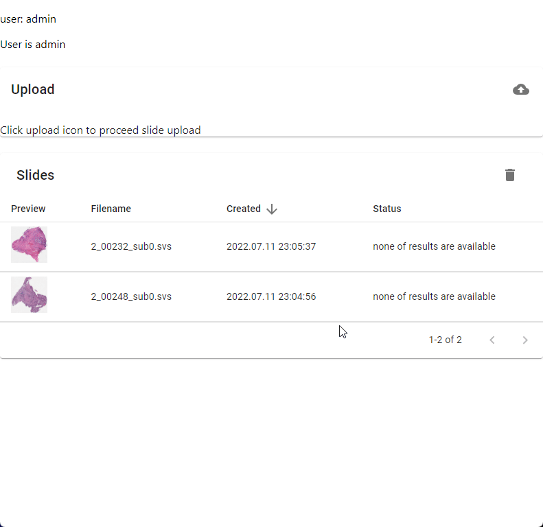
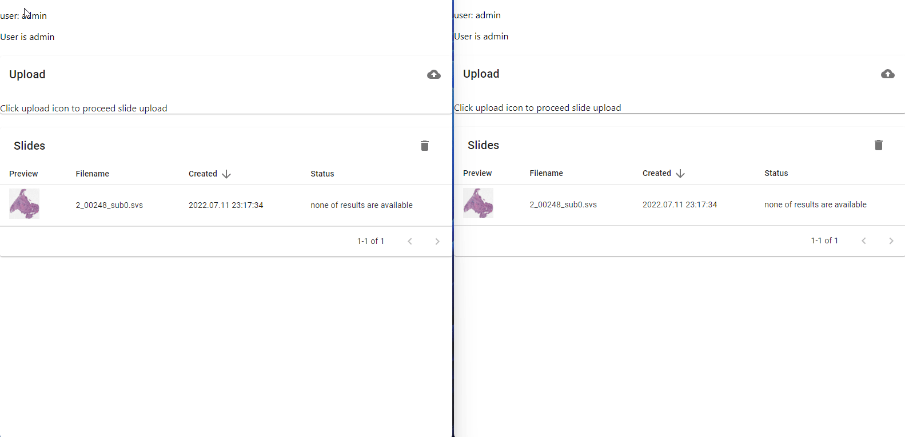

# Slide segmentation web service

This serivce provides management of the slides and check segmented results based on [Cytomine](https://github.com/cytomine-uliege)

## Requirements

* Cytomine
    * Install [Cytomine](https://github.com/lunarbridge/Cytomine-bootstrap) service (branch must be **slide-seg-svc**)
    * Add [Segmentation](https://github.com/fibremint/cm-software_segmentation-predict) software on your Cytomine web interface. You can find [more information](https://doc.uliege.cytomine.org/dev-guide/algorithms/add-software#step-4-add-your-software-to-the-cytomine-platform).
        * Trusted source: 
            * Source code provider username: fibremint
            * Environment provider username: fibremint
* Slide prediction service
    * Copy `.env.local.example` file to `.env` at frontend directory (`./client`)
    * Modify environment variables in `.env` to match with your Cytomine service environment
        * e.g. set Cytomine's core url to `REACT_APP_REMOTE_SERVER`
    * Build docker image in the each of `./client` and `./socket-server` directory
    * **(Optional)** if Cytomine's service environments are changed, modify `.env` and build docker image again

## Demo
### Viewer

### File upload

### Predict slide

### Sync updates

